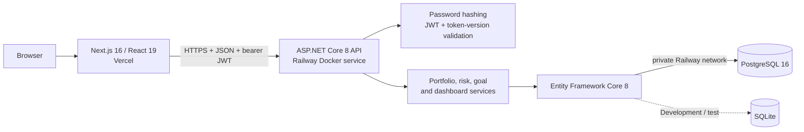
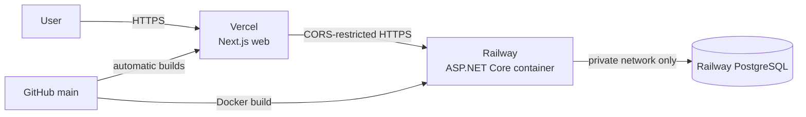

# PlanVest

[](https://planvest-pi.vercel.app)
[](https://planvest-production.up.railway.app/api/health)
[](https://github.com/reinaldozhu6-web/planvest/actions/workflows/ci.yml)
[](apps/web)
[](apps/api)

PlanVest is a deployed full-stack investment-planning application built as a
Software Developer / Co-op portfolio project. It demonstrates authenticated,
user-isolated workflows across a responsive Next.js client, an ASP.NET Core API,
and PostgreSQL persistence.

Users can record simulated accounts, holdings, and transactions; inspect asset
allocation; complete an explainable risk assessment; compare their portfolio
with a generic model allocation; and plan progress toward financial goals.

**[Open the live application](https://planvest-pi.vercel.app)** ·
**[Check API health](https://planvest-production.up.railway.app/api/health)** ·
**[Read the architecture notes](docs/architecture.md)**

> PlanVest is an educational planning tool. It does not connect to brokerages,
> execute trades, provide tax advice, recommend individual securities, or
> guarantee returns. All demo data is synthetic.

## Quick product tour

1. Open the [live demo](https://planvest-pi.vercel.app).
2. Select **Explore demo** to create a fresh, isolated synthetic workspace.
3. Review the dashboard, portfolio, transactions, allocation, risk result, and
   goals without entering personal information.
4. On a phone-sized screen, use the navigation drawer to move between the same
   workflows.

The planned README screenshot set and capture guidance are documented in
[Portfolio presentation](docs/PORTFOLIO.md). Screenshots are not represented as
finished assets until production-safe captures have been reviewed and committed.

## Core functionality

- **Authentication:** registration, password hashing, 30-minute JWT sessions,
  server-side logout invalidation, auth rate limiting, and protected routes.
- **Portfolio management:** account and holding CRUD, decimal market-value math,
  transaction history, and live allocation summaries.
- **Risk assessment:** a versioned seven-question model with explainable scoring,
  thresholds, rationale, and Conservative, Balanced, or Growth model allocations.
- **Goal planning:** goal CRUD and archiving, progress tracking, future-value
  projections, and required-contribution calculations.
- **Dashboard:** an aggregate read model for portfolio totals, allocation, risk,
  goals, and recent activity.
- **Demo isolation:** every demo session creates a separate synthetic user and
  data graph rather than sharing a mutable global account.
- **Responsive navigation:** the desktop sidebar is retained on larger screens;
  a keyboard-dismissible drawer exposes the complete workflow on mobile.

## Architecture



The web client owns presentation and temporary form state. The API is
authoritative for identity, authorization, validation, persistence, and financial
calculations. Every user-owned query is scoped by the authenticated JWT subject;
a resource ID alone never grants access.

```text
apps/web/                   Next.js client and typed API adapter
apps/api/Endpoints/         Thin HTTP endpoint modules
apps/api/Models/            Relational domain model
apps/api/Services/          Deterministic business logic
apps/api/Data/Migrations/   Reproducible PostgreSQL schema
tests/PlanVest.Api.Tests/   Unit and real-process integration tests
docs/                       PRD, architecture, deployment, portfolio notes
```

See the [approved MVP PRD](docs/PlanVest_MVP_PRD_v1.md),
[implementation contract](docs/IMPLEMENTATION.md), and
[architecture notes](docs/architecture.md) for the decisions behind the code.

## Technology stack

| Layer | Technology |
| --- | --- |
| Web | Next.js 16, React 19, TypeScript 5, Recharts, Lucide |
| API | C#, ASP.NET Core 8 minimal APIs, OpenAPI |
| Data | Entity Framework Core 8, PostgreSQL 16, SQLite |
| Authentication | ASP.NET Core password hashing, JWT, token-version invalidation |
| Testing | xUnit, real Kestrel HTTP integration tests, Node test runner |
| Delivery | GitHub Actions, multi-stage Docker build, Railway, Vercel |

## Testing and CI

Every pull request runs three independent GitHub Actions jobs:

| Job | Checks |
| --- | --- |
| Web | Clean dependency install, ESLint, production Next.js build |
| API | Restore, Release build, xUnit suite, production Docker build |
| PostgreSQL | API integration workflow, fresh migration, pending-model check |

The API suite covers authentication and logout invalidation, cross-user resource
isolation, demo seeding, portfolio and planning workflows, decimal financial
boundaries, error responses, SQLite startup, and PostgreSQL persistence. The
mobile navigation has a focused configuration/anchor test and was browser-checked
at 390 px; the desktop layout was checked at 1440 px.

Run the repository checks locally:

```bash
dotnet test PlanVest.sln --configuration Release

cd apps/web
npm test
npm run lint
npm run build
```

## Deployment

The live reference deployment uses Vercel for the Next.js client and Railway for
the Dockerized ASP.NET Core API and PostgreSQL database.



- Web: [https://planvest-pi.vercel.app](https://planvest-pi.vercel.app)
- API health:
  [https://planvest-production.up.railway.app/api/health](https://planvest-production.up.railway.app/api/health)
- Production CORS allows only the configured Vercel origin.
- Secrets and the PostgreSQL private connection remain in Railway variables.
- The API uses Railway's forwarded-header boundary and per-client auth rate-limit
  partitioning behind the reverse proxy.

The full provisioning, environment-variable, migration, backup, and rollback
procedure is in the [deployment runbook](docs/DEPLOYMENT.md).

## Run locally

Prerequisites: [.NET 8 SDK](https://dotnet.microsoft.com/download/dotnet/8.0)
and [Node.js 22](https://nodejs.org/).

### 1. Start the API

```bash
dotnet restore PlanVest.sln
dotnet run --project apps/api/PlanVest.Api.csproj
```

The API listens on `http://localhost:5080`, creates a local SQLite database at
`apps/api/planvest.db`, and exposes Swagger in Development at
`http://localhost:5080/swagger`. Local onboarding does not require Docker or
PostgreSQL.

### 2. Start the web app

```bash
cd apps/web
cp .env.example .env.local
npm ci
npm run dev
```

Open `http://localhost:3000`. Choose **Explore demo** for an immediately seeded,
isolated workspace, or register a user and start with an empty portfolio.

The fixed local JWT key exists only in `appsettings.Development.json`.
Production startup requires a strong `Jwt__Key`, a PostgreSQL connection string,
and an exact `WebOrigin`; secrets must remain in the deployment platform rather
than source control.

## Representative API surface

| Area | Endpoints |
| --- | --- |
| Identity | Register, login, logout, demo session, current user |
| Portfolio | Account and holding CRUD, transactions, summary, allocation |
| Planning | Risk questions, assessment, latest result, allocation comparison |
| Goals | Goal CRUD/archive, future value, required contributions |
| Dashboard | Aggregate authenticated dashboard read model |

JSON enums are strings, dates use ISO 8601, and failures use RFC 7807 problem
details. Swagger is the complete executable contract in Development.

## Security and engineering decisions

- User-owned records are filtered by authenticated user ID; cross-user IDs return
  `404` without disclosing ownership.
- Passwords use ASP.NET Core's adaptive password hasher and are never logged.
- Logout increments a server-checked token version, invalidating issued tokens.
- Money and quantities use C# `decimal`; display rounding uses
  `MidpointRounding.AwayFromZero`.
- Unsupported database providers and missing production configuration fail at
  startup instead of silently falling back to SQLite.
- CI applies the complete migration chain to an empty PostgreSQL 16 database and
  checks for model drift.

The current browser session uses session-storage bearer authentication so the
split-origin design remains transparent for an interview-scale demo. A higher
security production product should move authentication to an HttpOnly, Secure,
SameSite cookie behind a same-origin backend-for-frontend or use an audited
identity provider.

## Scope and next steps

The deployed MVP includes the workflows listed above. Brokerage connectivity,
live market data, trade execution, refresh tokens, password reset, email
verification, CSV export, production observability, and automated browser E2E
coverage are intentionally outside the current scope.

Potential next increments are listed in [Portfolio presentation](docs/PORTFOLIO.md)
so planned work stays clearly separated from shipped functionality.
