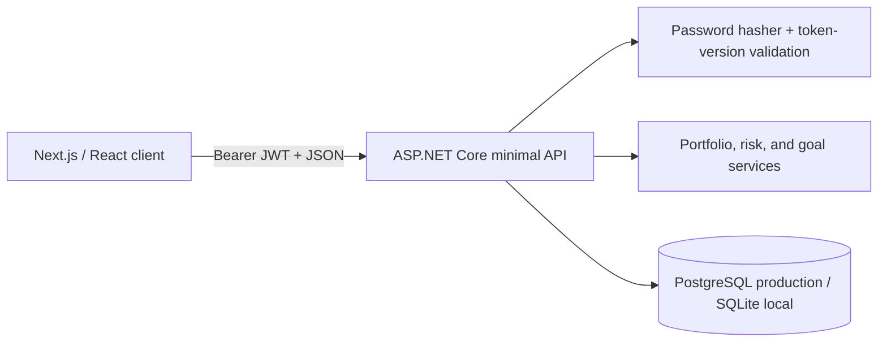

# PlanVest

PlanVest is an educational, full-stack investment-planning workspace built as a
software-engineering portfolio project. It lets a user record simulated accounts
and holdings, understand asset allocation, complete an explainable risk
assessment, compare against a generic model allocation, and project progress
toward financial goals.

> PlanVest does not connect to brokerages, execute trades, calculate taxes, or
> provide financial or investment advice. Demo values are synthetic and future
> returns are never guaranteed.

## What the MVP demonstrates

- Registration, password hashing, short-lived JWT authentication, and real
  server-side logout invalidation
- Per-user authorization on accounts, holdings, transactions, assessments, and
  goals, including cross-user isolation tests
- Account and holding CRUD, a transaction history, decimal market-value math,
  and live asset allocation
- A versioned seven-question risk model with thresholds, rationale, and generic
  Conservative, Balanced, and Growth allocations
- Goal CRUD and archiving, progress tracking, future-value projections, and
  required-contribution calculations
- An isolated synthetic demo workspace that a reviewer can open without sharing
  personal information
- PostgreSQL production migrations, SQLite local development, OpenAPI, RFC 7807
  errors, rate limiting, responsive UI, CI, unit tests, and real HTTP integration
  tests against both database providers

## Architecture



The web client owns presentation and form state. The API is authoritative for
identity, authorization, validation, persistence, and all financial
calculations. User-owned queries are filtered by the authenticated JWT subject;
a resource ID by itself never grants access.

```text
apps/web/                   Next.js client and typed API adapter
apps/api/Endpoints/         Thin HTTP endpoint modules
apps/api/Models/            Relational domain model
apps/api/Services/          Deterministic business logic
apps/api/Data/Migrations/   Reproducible PostgreSQL production schema
tests/PlanVest.Api.Tests/   Unit and real-process integration tests
docs/                       PRD, implementation contract, architecture, interview guide
```

See [the approved PRD](docs/PlanVest_MVP_PRD_v1.md),
[implementation contract](docs/IMPLEMENTATION.md), and
[architecture notes](docs/architecture.md) for the decisions behind the code.

## Technology

- Next.js 16, React 19, TypeScript, Recharts, Lucide
- ASP.NET Core 8, C#, EF Core 8, PostgreSQL, SQLite, OpenAPI
- xUnit and GitHub Actions
- Node.js 22 and .NET 8 in CI

## Run locally

Prerequisites: [.NET 8 SDK](https://dotnet.microsoft.com/download/dotnet/8.0)
and [Node.js 22](https://nodejs.org/).

### 1. Start the API

```bash
dotnet restore PlanVest.sln
dotnet run --project apps/api/PlanVest.Api.csproj
```

The API listens on `http://localhost:5080`, creates the local SQLite database at
`apps/api/planvest.db`, and exposes Swagger in development at
`http://localhost:5080/swagger`. PostgreSQL migrations are reserved for the
production provider so local onboarding does not require Docker.

The fixed local JWT key exists only in `appsettings.Development.json`. Production
does not inherit it: startup fails unless `Jwt__Key` is provided, and the API
rejects keys carrying the `development-only-` prefix outside Development. For a
deployed instance, provide a strong random `Jwt__Key`, the database connection
string, and allowed web origin through a secret manager or environment
configuration. Never copy the committed development key into a public runtime.

### 2. Start the web app

```bash
cd apps/web
cp .env.example .env.local
npm ci
npm run dev
```

Open `http://localhost:3000`. Choose **Explore demo** for an immediately seeded,
isolated workspace, or register a new account and build an empty portfolio.

## Verify the repository

```bash
dotnet test PlanVest.sln --configuration Release

cd apps/web
npm run lint
npm run build
```

The API suite covers financial boundaries and runs workflows against a real
Kestrel process and fresh SQLite database. CI additionally builds the production
Docker image, applies migrations to an empty PostgreSQL 16 database, and runs a
PostgreSQL API workflow before performing the clean frontend lint/build.

## Deploy

The low-cost reference deployment uses Vercel for the Next.js client and Railway
for the Dockerized API plus PostgreSQL. No production credential belongs in this
repository. See [the deployment runbook](docs/DEPLOYMENT.md) for required
variables, provisioning order, validation, backups, and rollback.

### PostgreSQL migrations

The repository pins the EF Core CLI through its local tool manifest. Set
`PLANVEST_MIGRATIONS_CONNECTION` to a protected Npgsql connection string, then
run migrations from the repository root:

```bash
dotnet tool restore
dotnet tool run dotnet-ef database update \
  --project apps/api --startup-project apps/api --context AppDbContext
```

Create future PostgreSQL migrations with `dotnet tool run dotnet-ef migrations
add <MigrationName>` plus the same project, startup-project, and context options.
Review the generated SQL/model snapshot and take a database backup before
applying any production migration. Application rollback does not automatically
reverse schema changes; use backward-compatible migrations and the recovery
procedure in the deployment runbook.

## Representative API surface

| Area | Endpoints |
| --- | --- |
| Identity | `POST /api/auth/register`, `login`, `logout`, `demo-session`; `GET /api/auth/me` |
| Portfolio | Account and holding CRUD, transaction creation, portfolio summary/allocation |
| Planning | Risk questions/assessment/latest result and allocation comparison |
| Goals | Goal CRUD/archive plus future-value and required-contribution simulations |
| Dashboard | `GET /api/dashboard` aggregate read model |

JSON enums are strings, dates use ISO 8601, and failures use problem details.
Swagger is the complete, executable contract.

## Security and financial correctness

- Passwords use ASP.NET Core's adaptive password hasher and are never logged.
- JWTs expire after 30 minutes. Logout increments a server-checked token version,
  invalidating previously issued tokens for that user.
- Registration, login, and demo-session requests are rate-limited per client IP
  and return HTTP `429` when the limit is reached. CORS accepts only the
  configured web origin.
- Railway proxy headers are processed only when `Hosting__Provider=Railway`; the
  trusted network and one-hop limit keep client-IP rate limiting meaningful
  behind TLS termination.
- Cross-user IDs return `404` without disclosing ownership.
- Persisted quantities and money use C# `decimal`; displayed monetary rounding
  uses `MidpointRounding.AwayFromZero`.
- Demo users receive unique synthetic workspaces and inaccessible random
  passwords.

For a public production deployment, move browser authentication to an HttpOnly,
Secure, SameSite cookie through a same-origin backend-for-frontend or use an
audited identity provider. The session-storage bearer design is intentionally a
transparent, interview-scale trade-off, not the final hardening step.

## Current delivery status

The MVP is merged into `main`. Deployment-readiness work is isolated on
`codex/deployment-readiness`; public cloud resources are not created until the
product owner separately approves deployment. Brokerage/market-data connections,
refresh tokens, password reset, email verification, CSV export, and production
telemetry remain intentionally deferred.

