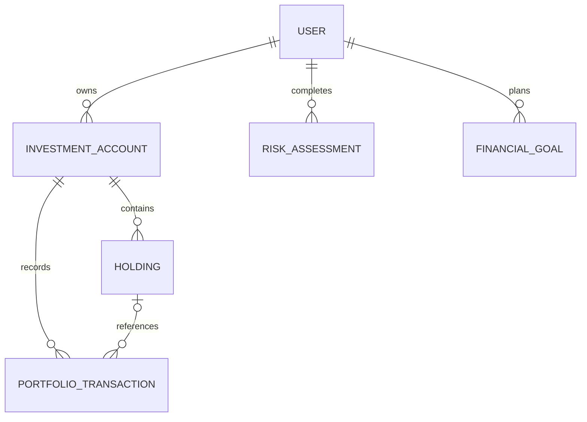

# PlanVest MVP implementation contract

**Product source of truth:** [`PlanVest_MVP_PRD_v1.md`](PlanVest_MVP_PRD_v1.md)
**Branch:** `codex/mvp-foundation`
**Pull request:** #1 into `main`
**Delivery rule:** do not merge without explicit product-owner approval

This document turns the approved PRD into an executable engineering plan. A
developer or coding agent should be able to select the first incomplete slice,
implement it without inventing product policy, run the listed checks, and update
the status table.

## Architecture decisions

| Concern | Decision | Why |
| --- | --- | --- |
| Repository | Next.js client and ASP.NET Core API monorepo | Makes the full request path visible in one interview project |
| Authentication | 30-minute bearer JWT plus a server-checked token version | Simple local setup while allowing logout to invalidate issued tokens |
| Passwords | ASP.NET Core `PasswordHasher` | Uses a reviewed adaptive password-hashing implementation |
| Local database | SQLite with committed EF Core migrations | One-command onboarding and visible relational modelling |
| Production database | Keep EF mappings portable to PostgreSQL | Avoid SQLite-only domain assumptions |
| Money | C# `decimal`, JSON numbers, database decimal columns | Prevent binary floating-point persistence errors |
| User isolation | Scope every owned-resource query by JWT subject | Prevent insecure direct object references |
| Demo | Create an isolated synthetic workspace on demand | Reviewers can explore without entering personal information |
| Risk model | Versioned, deterministic questionnaire | Results stay explainable and testable |
| UI data | API is authoritative; dashboard refetches after mutations | Avoid divergent client-side financial calculations |

## Vertical slices and acceptance evidence

| Slice | PRD requirements | Server evidence | Web evidence | Automated evidence | Status |
| --- | --- | --- | --- | --- | --- |
| Identity | AUTH-01–03, DEMO-01 | Register, login, logout, `me`, demo session; token-version validation | Registration/login/demo entry and protected dashboard | Auth and unauthorized integration tests | Complete |
| Portfolio | PORT-01–05 | Owned account/holding/transaction CRUD; summary and allocation | Account and holding forms, transaction history, totals, allocation | Cross-user and calculation tests | Complete |
| Risk and allocation | RISK-01–03, PLAN-01–03 | Versioned questions, stored score, model comparison | Questionnaire, rationale, allocation gaps | Threshold and invalid-answer tests | Complete |
| Goals and simulation | GOAL-01–02, SIM-01–02 | Goal CRUD/archive and decimal projection services | Goal form, progress, interactive simulator | Formula and real API workflow tests | Complete |
| Delivery | NFRs, definition of done | Problem details, migrations, OpenAPI, health | Responsive/error/empty states | CI build, lint, 13 backend tests | Complete |

## API conventions

- Root path: `/api`.
- Protected endpoints require `Authorization: Bearer <token>`.
- JSON enums are strings to keep requests readable.
- Validation failures use `application/problem+json` with a stable title and
  field-level errors when available.
- Cross-user resource IDs return `404`, not ownership details.
- Dates use ISO 8601; monetary values are decimal JSON numbers.
- `GET /api/dashboard` is the interview-friendly aggregate read model. CRUD
  endpoints remain the source for mutations.

## Data relationships



Deleting an account cascades to its holdings and transactions. Deleting a
holding keeps transaction history and clears the optional holding reference.

## Risk scoring version 1

The API publishes seven questions and the allowed options. Each option maps to a
documented score; the maximum is 100. The stored assessment includes the exact
answer map and `ScoringVersion = "1.0"`.

- `0–35`: Conservative — 35% equity, 55% fixed income, 10% cash
- `36–70`: Balanced — 65% equity, 30% fixed income, 5% cash
- `71–100`: Growth — 85% equity, 10% fixed income, 5% cash

The result explains the most influential answers and always carries an
educational-use disclaimer.

## Local verification

```powershell
dotnet restore PlanVest.sln
dotnet test PlanVest.sln --configuration Release

cd apps/web
npm ci
npm run lint
npm run build
```

For an end-to-end smoke test, start the API on `http://localhost:5080`, start the
web app on `http://localhost:3000`, create a demo workspace, add and delete a
holding, submit a risk assessment, and create a goal. Confirm the dashboard
updates after each mutation.

## Deferred beyond this MVP pull request

- Real market prices and historical performance
- CSV export and extended transaction editing
- Refresh tokens, password reset, and email verification
- Production identity provider, telemetry backend, and PostgreSQL deployment
- Public hosting, which requires separate approval
