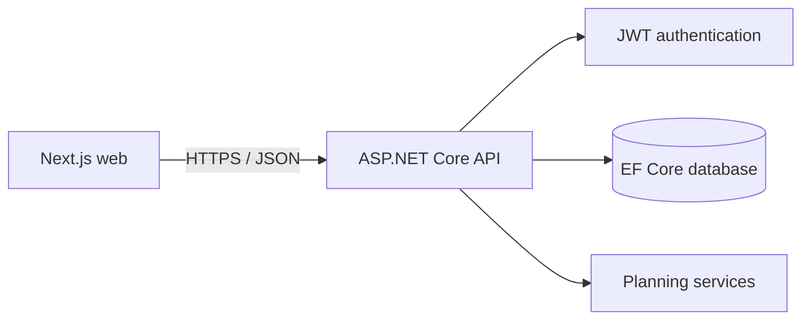

# Architecture

## Runtime shape

The web client owns presentation and form state. The API owns authentication, authorization, validation, persisted financial data, and decimal-based calculations. Every user-owned query is filtered by the authenticated user identifier.

## Authentication decision

Milestone 1 uses short-lived bearer tokens for a deployment-neutral API contract. Passwords are hashed with ASP.NET Core's `PasswordHasher`; raw passwords are never stored or logged. A production deployment should place tokens in an HttpOnly secure cookie through a same-origin backend-for-frontend or use an audited identity provider.

## Data isolation rule

Resource IDs alone never grant access. Each account, holding, assessment, and goal query includes the current user's ID. Cross-user requests return not found or forbidden without exposing another user's data.

