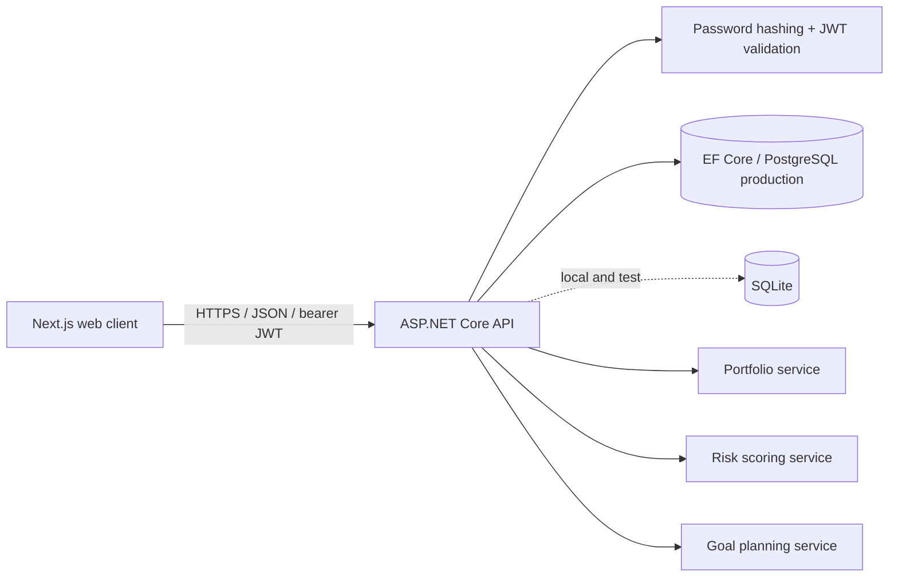
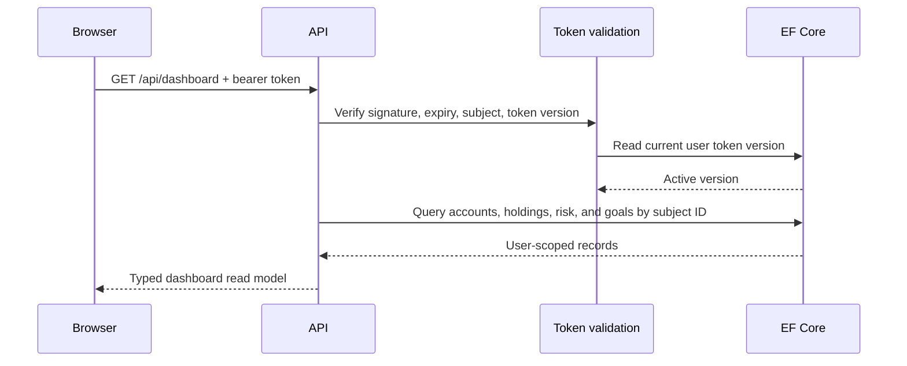
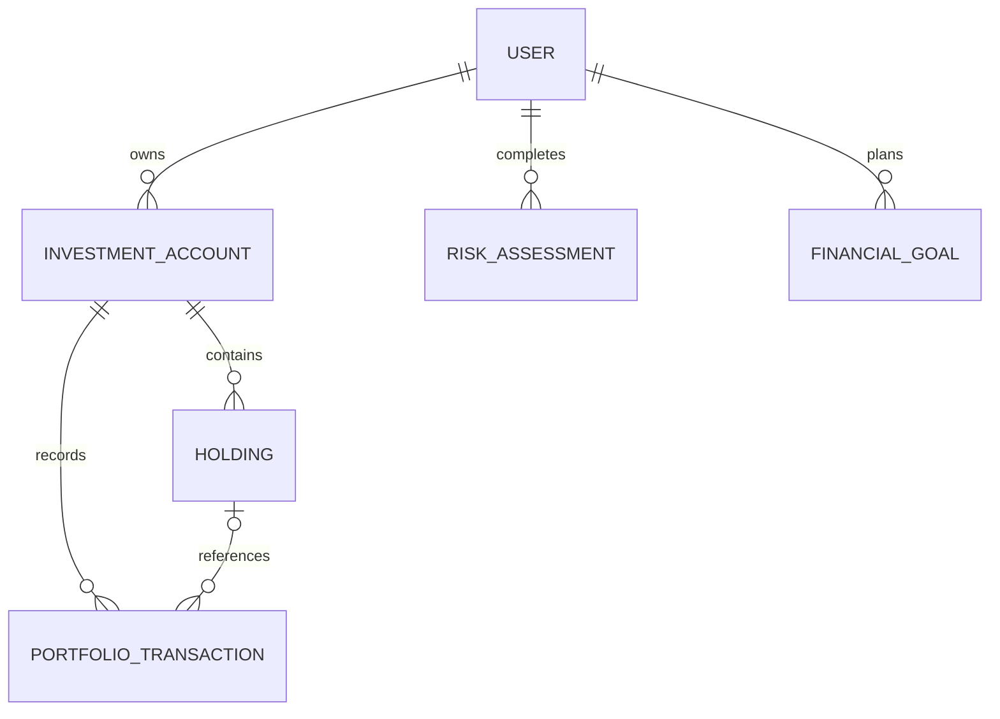

# PlanVest architecture

## Runtime shape

The client owns presentation and temporary form state. The API owns identity,
authorization, validation, persistence, and every financial calculation. The
dashboard uses one aggregate read model, while mutations use resource-oriented
endpoints. This keeps the interview demo fast without hiding the underlying CRUD
contract.

## Request flow

## Authentication decision

Passwords use ASP.NET Core's `PasswordHasher`. A successful registration, login,
or demo-session request issues a 30-minute JWT containing the user subject and a
token-version claim. JWT middleware checks that version against the database on
every protected request. Logout increments the stored version, so the token is
rejected even if the browser retained it.

The bearer token is kept in session storage for a transparent, split-origin local
demo. A public production deployment should replace this with an HttpOnly,
Secure, SameSite cookie behind a same-origin backend-for-frontend or an audited
identity provider.

## Authorization and privacy

Resource IDs are locators, not permissions. Every owned-resource query also
includes the authenticated user ID. Cross-user reads and mutations return `404`
without disclosing that another user's record exists. The demo endpoint creates a
new synthetic user and data graph instead of sharing a mutable global account.

## Domain and deletion rules

- Deleting an account cascades to its holdings and transaction records.
- Deleting a holding keeps account transaction history and clears the optional
  holding reference.
- Deleting a user cascades through all owned data.
- Risk answers are stored with the scoring version so historical results remain
  explainable when a future questionnaire changes.

## Financial calculations

Persisted money and quantities use C# `decimal`. Portfolio market value is the
sum of quantity × current price, allocation is grouped from that market value,
and monetary display values use midpoint rounding away from zero. Goal projections
use monthly compounding and have a separate zero-rate path to avoid division by
zero. Inputs are constrained to finite product ranges before calculations run.

## Database providers and migrations

Development and ordinary integration tests use SQLite so a reviewer can clone
and run the project without provisioning infrastructure. SQLite startup uses the
current EF model to create a disposable/local schema. Production selects Npgsql
and applies the committed PostgreSQL migrations. The provider is explicit in
`Database:Provider`; an unsupported provider or missing production connection
string fails startup instead of silently falling back to a local file.

The PostgreSQL model snapshot is committed so every future production schema
change produces a reviewable differential migration. CI applies the complete
migration chain to an empty PostgreSQL 16 database and checks for pending model
changes.

SQLite cannot translate `DateTimeOffset` ordering. Queries first filter by user
in SQL and then order the already-scoped, small result set in memory. This keeps
correctness explicit and prevents unbounded cross-user materialization.

## Reliability and verification

- RFC 7807 problem responses include a trace ID.
- Registration, login, and demo-session requests use a per-client-IP fixed-window
  rate limiter; rejected requests return HTTP 429.
- OpenAPI is available in development.
- Unit tests cover risk thresholds, decimal allocation, goal progress, and
  projection boundaries.
- Integration tests start a real Kestrel process, create a fresh SQLite database,
  and verify authentication, logout invalidation, demo seeding, planning, and
  cross-user isolation over HTTP.
- A PostgreSQL integration test starts the same API process, applies the
  production migration, and exercises registration, account creation, holdings,
  decimal persistence, and portfolio aggregation.
- CI builds the exact multi-stage Dockerfile used by Railway.

